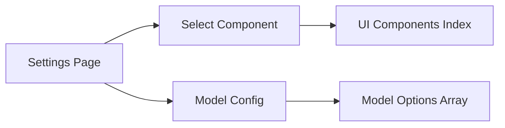

## 用户需求

在前端设置页面添加四个可选模型的下拉选择功能，用户可以通过下拉框快速选择预设模型，无需手动输入模型名称。

## 产品概述

为 LLM 配置页面增加模型选择下拉框，提供预设的模型选项，提升用户体验和配置效率。

## 核心功能

- 下拉选择框展示四个可选模型：qwen3.5-plus（支持图片理解）、kimi-k2.5（支持图片理解）、glm-5、MiniMax-M2.5
- 标记支持图片理解的模型
- 保留现有的配置加载和保存逻辑

## 技术栈

- 前端框架：React + TypeScript
- 样式方案：Tailwind CSS
- 组件风格：遵循现有 Material Design 风格

## 实现方案

### 系统架构

采用组件化架构，新增 Select 组件复用于未来其他下拉选择场景。



### 模块划分

1. **Select 组件**：通用下拉选择组件，支持 label、helperText、disabled 等属性
2. **模型配置**：定义可用模型列表及其属性
3. **Settings 页面更新**：集成 Select 组件替换原有 Input

### 数据流

```
页面加载 -> 获取配置 -> 填充表单
用户选择模型 -> 更新 form.model
点击保存 -> POST /api/sft/config -> 后端存储
```

## 目录结构

```
src/
├── components/ui/
│   ├── Select.tsx    # [NEW] 通用下拉选择组件，遵循现有 Material Design 风格
│   └── index.ts      # [MODIFY] 导出 Select 组件
├── lib/
│   └── models.ts     # [NEW] 模型配置文件，定义可选模型列表
└── pages/
    └── Settings.tsx  # [MODIFY] 将模型输入框改为下拉选择框
```

## 实现细节

- Select 组件使用原生 `<select>` 元素，样式与现有 Input 组件保持一致
- 模型配置使用 `litellm` 格式命名（`provider/model-name`）
- 支持图片理解的模型在选项中显示标记（如 `(支持图片理解)`）